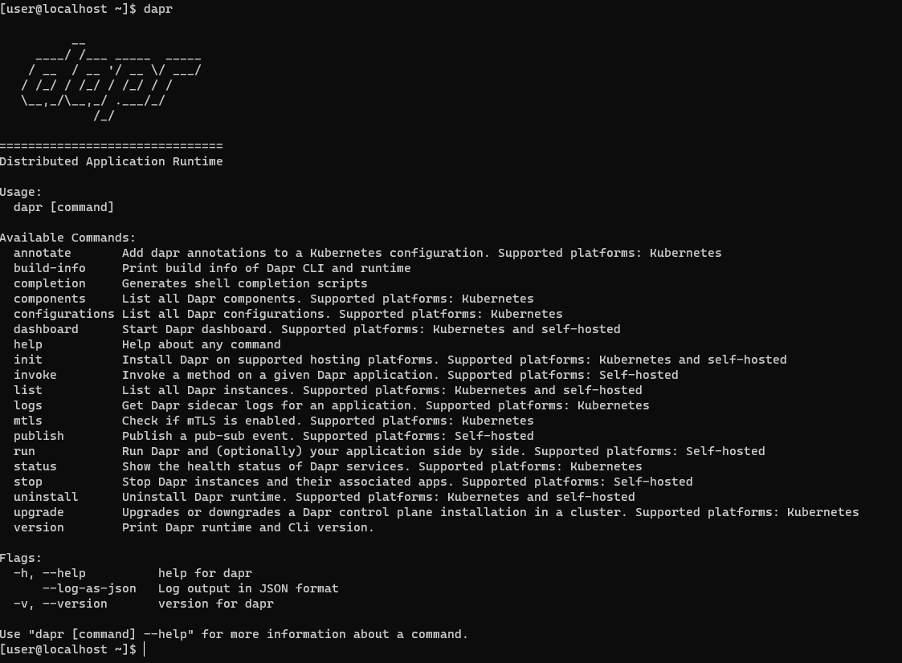
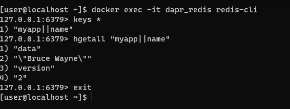

# Env
## Hardware
* Rockchip Rk3588s LP4X EVB 
## Software
* 镜像需要自己移植
# Install


**整个Dapr的运行Demo主要参考[Dapr文档](https://docs.dapr.io/zh-hans/getting-started/install-dapr-cli/)。**

## Install docker

### Docker Install
* 因为openEuler提供的repo源中，docker的版本过低，导致Edgex无法顺利运行，所以需要手动安装docker二进制包，并配置daemon 服务。
```
# 通过二进制包的方式安装docker
wget https://download.docker.com/linux/static/stable/aarch64/docker-20.10.17.tgz
dnf install tar -y
tar zxvf docker-20.10.17.tgz
cp -p docker/* /usr/local/bin

# 配置docker服务
sudo cat > /usr/lib/systemd/system/docker.service <<EOF
[Unit]
Description=Docker Application Container Engine
Documentation=http://docs.docker.com
After=network.target docker.socket
[Service]
Type=notify
EnvironmentFile=-/run/flannel/docker
WorkingDirectory=/usr/local/bin
ExecStart=/usr/local/bin/dockerd -H tcp://0.0.0.0:4243 -H unix:///var/run/docker.sock --selinux-enabled=false --log-opt max-size=1g
ExecReload=/bin/kill -s HUP $MAINPID
# Having non-zero Limit*s causes performance problems due to accounting overhead
# in the kernel. We recommend using cgroups to do container-local accounting.
LimitNOFILE=infinity
LimitNPROC=infinity
LimitCORE=infinity
# Uncomment TasksMax if your systemd version supports it.
# Only systemd 226 and above support this version.
#TasksMax=infinity
TimeoutStartSec=0
# set delegate yes so that systemd does not reset the cgroups of docker containers
Delegate=yes
# kill only the docker process, not all processes in the cgroup
KillMode=process
Restart=on-failure
[Install]
WantedBy=multi-user.target
EOF


groupadd docker
chgrp docker /var/run/docker.sock

systemctl enable docker
systemctl start docker

sudo groupadd docker
usermod -aG docker $USER
# 验证配置成功
docker info

# 验证docker 安装正确
docker run hello-world
```
## Install Dapr
* 安装`Dapr CLI`到`/usr/local/bin`
```
wget -q https://raw.githubusercontent.com/dapr/cli/master/install/install.sh -O - | /bin/bash

```
* 验证安装
```
dapr
```


## 在本地环境中初始化Dapr
Dapr 与您的应用程序一起作为sidecar运行，在自托管模式下，这意味着它是您本地机器上的一个进程。 因此，初始化 Dapr 包括获取 Dapr sidecar 二进制文件并将其安装到本地.

此外，默认初始化过程还创建了一个开发环境，帮助简化 Dapr 的应用开发。 这包括下列步骤：

* 运行一个用于状态存储和消息代理的Redis容器实例
* 运行一个用于提供可观察性的Zipkin容器实例
* 创建具有上述组件定义的 默认组件文件夹
* 运行用于本地演员支持的Dapr placement服务容器实例

### 在终端中运行`init CLI`命令
  安装最新的Dapr运行时二进制程序
  ```
  dapr init
  ```
### 验证Dapr版本
```
dapr --version
```

### 验证容器正在运行
  `dapr init`命令启动了几个容器，查看容器状态，确保`daprio/dapr`, `openzipkin/zipkin`和 `redis`均在运行


### 验证组件目录已初始化
在`dapr init`时，同时创建了一个默认组件文件夹，其中包括几个YAML文件，其中包含`state store`、`elevated`和`zipkin`。`Dapr sidecar`将读取这些文件。告诉它使用`Redis`容器进行状态管理和消息传递，以及`Zipkin`容器来收集跟踪。
```
ls $HOME/.dapr
```


## 使用`Dapr`的内置API
### 运行Dapr sidecar
通过`dapr run`命令，将与`sidecar`一起启动一个应用程序。
* 运行以下命令以启动`Dapr sidecar`,它将在端口`3500`上监听名为`myapp`的空白应用程序
* 使用下面命令，没有定义自定义组件文件夹。Dapr使用在init流中创建的默认组件定义，即使用本地的Redis Docker容器作为状态存储和消息代理。
```
dapr run --app-id myapp --dapr-http-port 3500
```

### 保存状态
* 将对象的状态，更新为如下状态
```
[
  {
    "key": "name",
    "value": "Bruce Wayne"
  }
]

```
**注意，状态中包含的对象有一个`key`其值`name`。**
```
curl -X POST -H "Content-Type: application/json" -d '[{ "key": "name", "value": "Bruce Wayne"}]' http://localhost:3500/v1.0/state/statestore

```
### 获取状态
使用状态管理API， 用key `name`来获取刚刚存储在状态中的对象。更多状态管理API参考[文档](https://docs.dapr.io/zh-hans/developing-applications/building-blocks/state-management/state-management-overview/)。
```
curl http://localhost:3500/v1.0/state/statestore/name
```

### 在Redis容器中，查看存储的状态
* 在`redis`容器中，使用`redis-cli`命令行
```
docker exec -it dapr_redis redis-cli

```
* 列出redis keys以查看Dapr如何创建一个键值对。
```
keys *
```
* 查看运行时状态值
```
hgetall "myapp||name"
```
* 退出`redis-cli`
```
exit
```


## 定义一个组件
### 创建一个`JSON`密钥存储
保存下面的内容到`mysecrets.json`的文件
```
{
   "my-secret" : "I'm Batman"
}

```
### 创建一个密钥存储Dapr组件
* 创建一个名为`my-components`的目录来存放新的组件内容
```
mkdir my-components

```
* 在此目录中创建一个新文件`localSecretStore.yaml`,保存如下内容，替换`<PATH TO SECRETS FILE>`为文件`mysecrets.json`的绝对路径, 其中，`type: secretstores.local.file` 字段值，其告诉Dapr使用本地文件组件作为密钥存储。
```
apiVersion: dapr.io/v1alpha1
kind: Component
metadata:
  name: my-secret-store
  namespace: default
spec:
  type: secretstores.local.file
  version: v1
  metadata:
  - name: secretsFile
    value: <PATH TO SECRETS FILE>/mysecrets.json
  - name: nestedSeparator
    value: ":"

```

### 运行Dapr sidecar
运行以下命令以启动 Dapr sidecar，它将在端口 3500 上监听名为 myapp 的空白应用程序：
```
dapr run --app-id myapp --dapr-http-port 3500 --components-path ./my-components
```
### 获取密钥
```
curl http://localhost:3500/v1.0/secrets/my-secret-store/my-secret
```


## more
更多应用实例，参考[Dapr快速入门](https://docs.dapr.io/zh-hans/getting-started/quickstarts/).