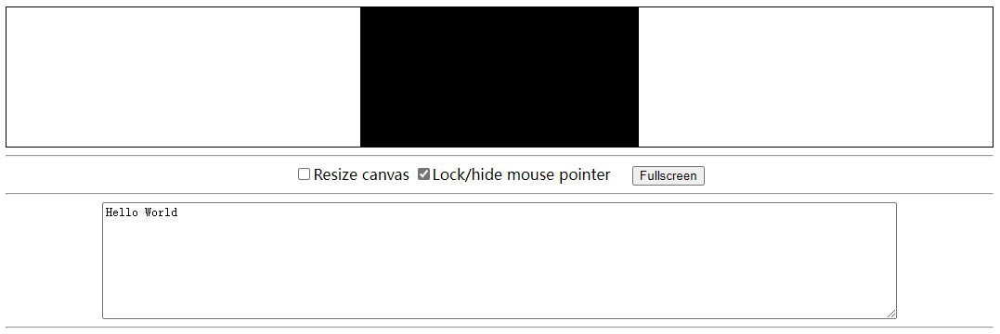
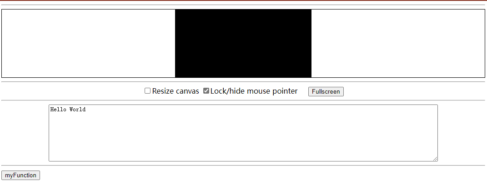
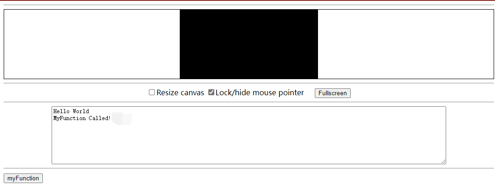
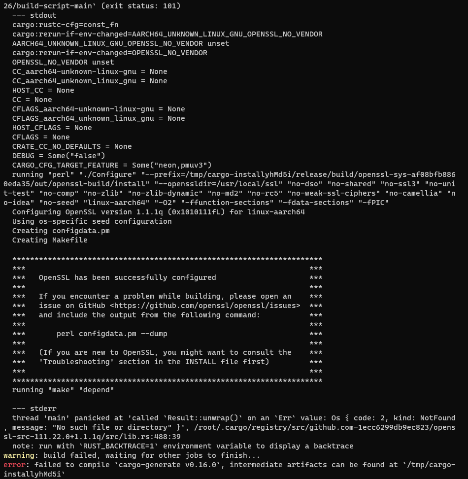
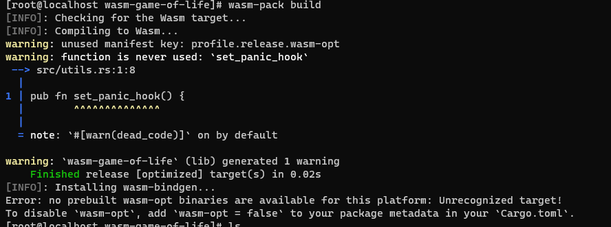

# Env
## Hardware
* [Raspberry Pi 4 B](https://www.raspberrypi.com/products/raspberry-pi-4-model-b/)
## Software
* [OS openEuler 22.03 LTS](https://repo.openeuler.org/openEuler-22.03-LTS/raspi_img/openEuler-22.03-LTS-raspi-aarch64.img) 
# Install
 **Operation system install**
* 请参考openEuler文档 [link](https://docs.openeuler.org/zh/docs/22.03_LTS/docs/Installation/%E5%AE%89%E8%A3%85%E5%87%86%E5%A4%87-1.html)。

**以下操作均在root用户下进行操作**
## Install emsdk
```
git clone https://github.com/juj/emsdk.git
cd emsdk
./emsdk install latest
./emsdk activate latest
source ./emsdk_env.sh


#根据提示，修改对应的环境变量 PATH, EMSDK, EM_CONFIG, EMSDK_NODE
```

## C Language Demo
* 编写如下内容C文件`index.c`.
  ```
  #include <stdio.h>
  #include <emscripten/emscripten.h>

  int main()
  {
      printf("Hello World\n");
      return 0;
  }

  #ifdef __cplusplus
  extern "C"{
  #endif
  //由于Emscripten编译器生成的代码只会只会调用main()主函数，其他函数会被认为是无效代码而消除，
  //因此需要从emscripten.h库中引入EMSCRIPTEN_KEEPALIVE修饰该函数，告诉编译器该函数需要被导出.
  EMSCRIPTEN_KEEPALIVE void myFunction(int argc, char ** argv)
  {
      printf("MyFunction Called!\n");
  }
  #ifdef __cplusplus 
  }
  #endif
  ```
* 从安装的`emsdk`中拷贝html模板到当前路径`emsdk/upstream/emscripten/src/shell_minimal.html`.

* 编译

  ```
  emcc -o index.html index.c -O3 -s WASM=1 -s "EXPORTED_RUNTIME_METHODS=['ccall']" --shell-file shell_minimal.html 
  ```

  * -s WASM=1：指定要输出.wasm文件，如果未指定，编译器默认只会生成 asm.js 文件
  * -o index.html: 指定编译器生成html文件与js文件，用于加载生成的 .wasm 文件
  * -O3: 表示编译优化选项，有0，1，2，3，s几个级别，级别越高生成的代码提及越小，反编译难度越高
  * --shell-file: 指定 html 模版文件
  * NO_EXIT_RUNTIME 参数: 为了在 main 函数退出时，运行时不会被关闭
  * “EXTRA_EXPORTED_RUNTIME_METHODS=[‘ccall’]”：指定导出的方法挂到 Module 的 ccall 方法中

  
  * `index.c` : c代码
  * `index.html` : 生成的预览html
  * `index.js` : 胶水层代码
  * `index.wasm`: 生成的wasm二进制文件
  * `shell_minimal.html` : 使用的html模板文件
* 开辟端口供访问
  ```
  emrun --no_browser --port 8080 .
  ```
  打开浏览器访问该机器的`8080`端口，查看页面显示内容
  
  **若无法访问`8080`地址，查看防火墙是否打开对应的ip端口**
  ```
  # 查看打开端口信息
  firewall-cmd --list-ports --zone=public
  # 添加端口
  firewall-cmd --add-port=8080/tcp --permanent --zone=public
  # 重启防火墙
  firewall-cmd --reload
  ```

* 在html中调用C中的方法`myFunction`
  * 在生成的`index.html`中，在标签<body>中添加一个按钮，并调用C中实现的函数`myFunction`
    ```
    <button class="mybutton">myFunction</button>
    <script type='text/javascript'>
    document.querySelector('.mybutton').addEventListener('click', function(){
      alert('检查控制台');
      var result = Module.ccall('myFunction', // name of C function
                                null, // return type
                                null, // argument types
                                null); // arguments
    });
    </script>
    ```
  * 在浏览器中刷新，查看改变,并点击建立的按钮
    
    


## Rust Language Demo
### setup
* 建立`Rust`语言环境, 详细查看[文档](https://www.rust-lang.org/zh-CN/).
* 下载相关的包[`wasm-pack`](https://rustwasm.github.io/wasm-pack/installer/)
* 安装`cargo-generate`包，`cargo install cargo-generate`
* 更新npm，`npm install npm@latest -g`
  **在cargo install cargo-generate, 编译openssh的错误，具体如下图所示**

  
  ```
  yum install openssl openssl-devel -y
  dnf install make
  ```
### hello world demo
* 先下载所需模板`cargo generate --git https://github.com/rustwasm/wasm-pack-template`, 并指定项目名`wasm-game-of-life`.
* 可以查看项目内容，与基本的Rust库项目结构基本一致.
  ```
    wasm-game-of-life/
  ├── Cargo.toml
  ├── LICENSE_APACHE
  ├── LICENSE_MIT
  ├── README.md
  └── src
      ├── lib.rs
      └── utils.rs
  ```
  * 主要的内容在`src/lib.rs` 中, 使用`wasm-bindgen`的与`JavaScript`通信。导入`JavaScript`函数`window.alert`, 导出`Rust`函数`greet`.
  ```
    mod utils;

    use wasm_bindgen::prelude::*;

    // When the `wee_alloc` feature is enabled, use `wee_alloc` as the global
    // allocator.
    #[cfg(feature = "wee_alloc")]
    #[global_allocator]
    static ALLOC: wee_alloc::WeeAlloc = wee_alloc::WeeAlloc::INIT;

    #[wasm_bindgen]
    extern {
        fn alert(s: &str);
    }

    #[wasm_bindgen]
    pub fn greet() {
        alert("Hello, wasm-game-of-life!");
    }
  ```
* Build the Project
    ```
      wasm-pack build
    ```
    * 遇到错误`Error: no prebuilt wasm-opt binaries are available for this platform`
      
      在文件`wasm-game-of-life/Cargo.toml`中新增如下内容
      ```
        [package.metadata.wasm-pack.profile.release]
        wasm-opt = false
      ```
  * 查看编译生成的文件内容
    ```
      pkg/
      ├── package.json
      ├── README.md
      ├── wasm_game_of_life_bg.wasm
      ├── wasm_game_of_life.d.ts
      └── wasm_game_of_life.js
    ```
  * 主要的工作内容为
    * 将我们的 rust 代码编译成 WebAssembly
    * 在 WebAssembly 上执行 wasm_bindgen，生成一个 js 文件，将 webassembly 文件引入到一个 NPM 可以识别的模块中
    * 创建一个 pkg 目录并将该上一步的 js 文件和 WebAssembly 代码移入其中
    * 读取 Cargo.toml 中的内容并产生等效 package.json 文件
    * 复制 README.md 文件至程序包中
* Putting it into a Web Page
  ```
    npm init wasm-app www
  ```
  * 查看生成的文件
    ```
    wasm-game-of-life/www/
    ├── bootstrap.js
    ├── index.html
    ├── index.js
    ├── LICENSE-APACHE
    ├── LICENSE-MIT
    ├── package.json
    ├── README.md
    └── webpack.config.js
    ```
* 安装依赖，切入生成的`www`目录，`npm install`
* 将调用生成的`wase`中的函数
  * 修改文件`wasm-game-of-life/www/package.json`, 增加如下内容
  ```
    "dependencies": {                    
    "wasm-game-of-life": "file:../pkg"
  },
  ```
  * 修改文件`asm-game-of-life/www/index.js`
    ```
    import * as wasm from "wasm-game-of-life";
    ```
  * 安装依赖
    ```
    npm install
    ```
* 启动服务
  * 修改启动配置，打开`asm-game-of-life/www/package.json`文件，修改`"scripts"` 中的`"start"`value
    ```
    "start": "webpack-dev-server --host 0.0.0.0"
    ```
  * 正式启动服务器
    ```
    npm run start
    ```
* 通过浏览器访问服务器`8080`端口
  
    
  